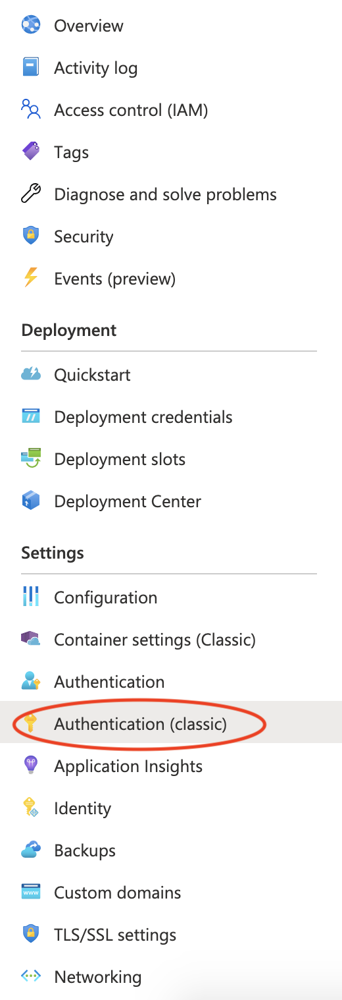
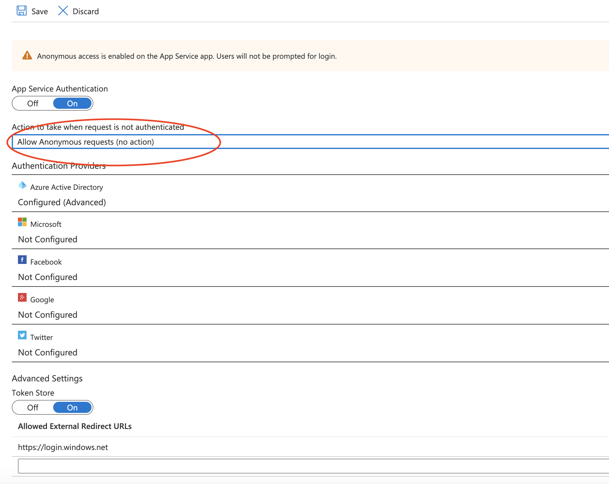

## About
This sub-project contains a suite of tests that verify and validate below features of an existing Project Staffing instance.

### Relevant files:

- `api-tests/src`

Contains all the test codebase.

- `api-tests/pom.xml`

Maven project `pom` file.

- `api-tests/run_tests.sh`

Top-level script for the test track. This script runs the tests. Used in `tests-pipeline.yml` definition.

- `api-tests/README.md`

`README` file for the tests themselves.

### Tested features:

  - configuration - tests for the search settings functionalities (data sources, search criteria, emails search)

  - employee_search - tests for search functionalities
    - search by skill or by name
    - search suggestions
    - search employee with different domains

  - team - tests for team functionalities:
    - add and remove employee from team
    - edit team title and description
    - export team report

## Pre-requisites
* Install and configure JDK 11
* Install and configure [Apache Maven 3.6.0+](http://maven.apache.org/)
* Download and install [Docker](https://www.docker.com/)

For running the API tests, in the azure app service, the authentication should be set to allow anonymous requests.

In the azure app service, select `Authentication(classic)`

Select the `Allow anonymous requests` option and save the modification

Also, in the `Configuration` panel, set the `ALLOW_ANONYMOUS_USER` to `true` like in the steps below:

## IDE setup

Before running the tests, depending on you IDE, run one of the following commands to configure the `zebrunner-agent.jar`
file, which is needed for running the tests:
- run `mvn clean idea:idea` in the `api-tests` folder (if you are using Intellij IDEA) or,
- run `mvn clean eclipse:eclipse` in the `api-tests` folder (if you are using Eclipse IDE)

For info and additional details, please  check out Carina's [Getting started](https://qaprosoft.github.io/carina/getting_started/)

## Running from terminal
The manner in which the tests can be run is by simply executing the `run_tests.sh` script.

The script will run the `mvn clean test` command and will generate the report using the `mvn surefire-report:report-only` after the run ends.

Run command example:
`sh run_tests.sh  <AppServiceUrl>`

`AppServiceUrl` - the URL of the App Service that is being tested

## Running from Intellij IDEA
To run the tests in Intellij IDEA, first you have to right-click on the test that you want to run and create a new run configuration for it.

Or you can run the entire set of tests by creating a new run configuration on the `src/test/java` folder.
You can do this by right-clicking the class and selecting the edit configuration.

After that,`AppServiceUrl` in the VM options, with the `-Dtestng.dtd.http=true`
argument, used to explicitly load the DTD from a http URL.

## Test results
After we run the tests, a report will be available in `target/suite` folder as `surefire-report.html` file.

## Writing new tests

The tests are being structured in:

- **Method** classes

  These classes extend `RESTMethod` that extends `AbstractApiMethodV2` and triggers the base class constructor for initialization.
  
  In general cases, you will specify the path to request and response templates along with default properties files.
  Also, we replace the URL placeholder to set an appropriate environment.

  **Note:** the `RESTMethod` class contains utility logic which is used in all tests

- Request payloads

  Add these to requests which require payloads.

  Save them in `src/main/resources/api/fixtures`

- **Test** classes

  Contain the tests' logic which executes the REST API call and verifies the response.
  
  Each test uses the static methods from `TestUtils` class where:
    - the REST call object is created
    - the expected HTTP status is specified 
    - the API is called, and the response returned
    
  In tests, the returned response is being validated and further calls are being made using the data from the previous call if needed.